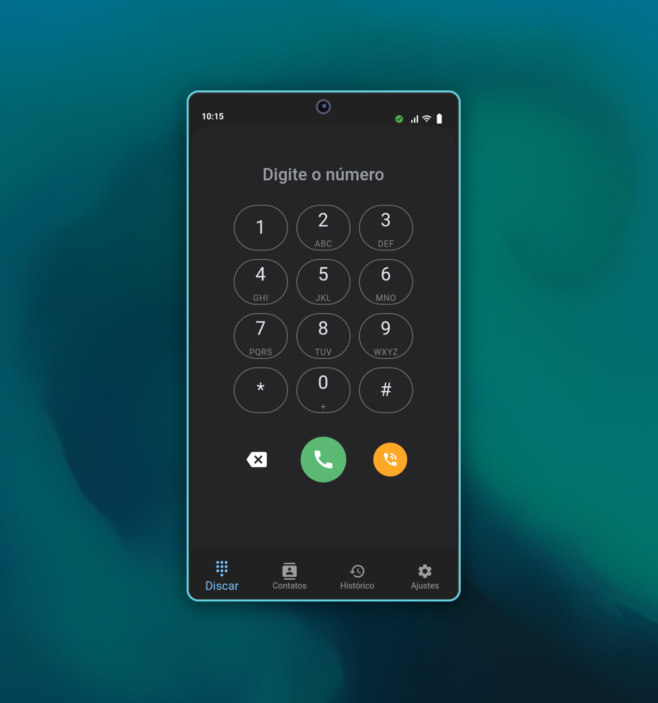
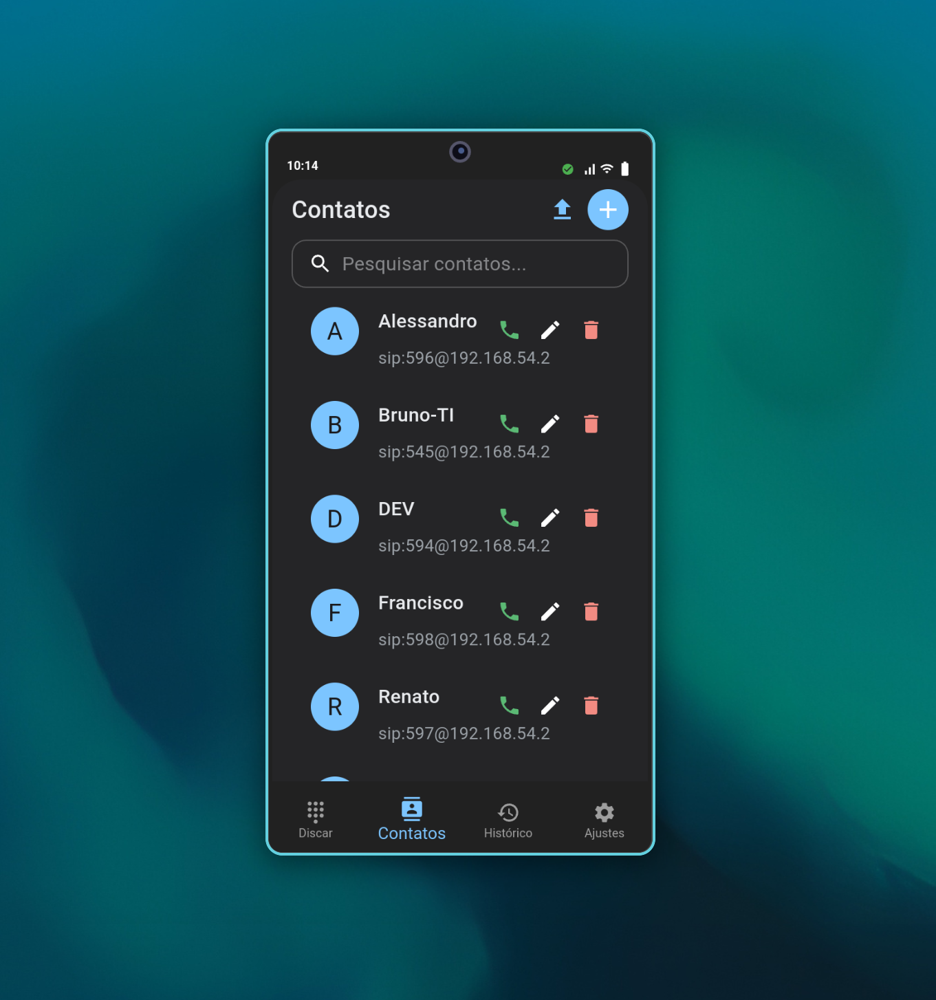
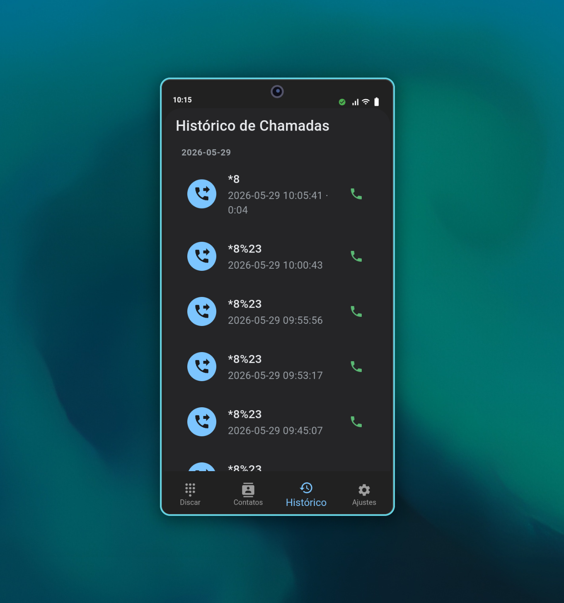
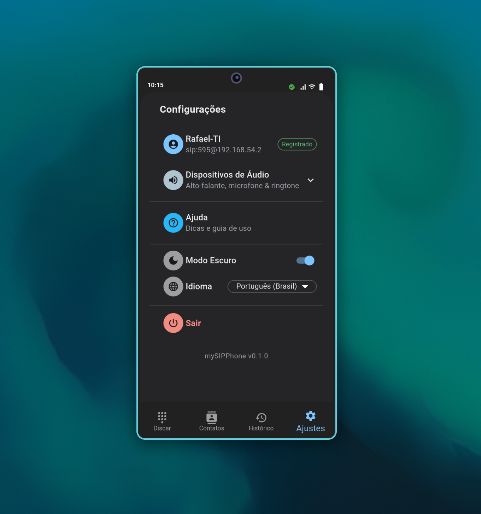
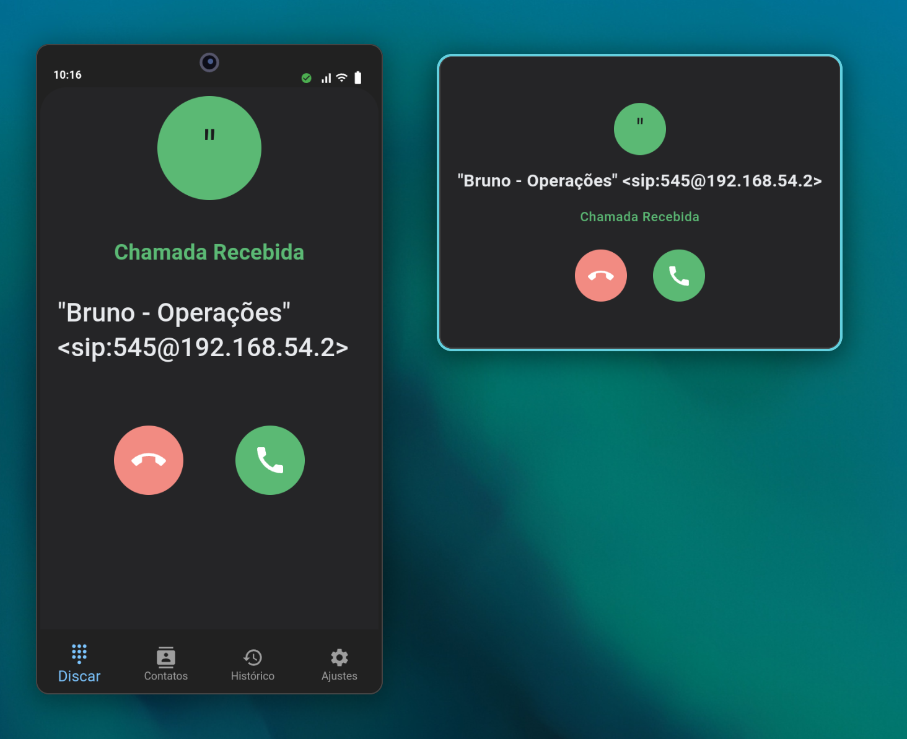

# mySIPPhone

Desktop SIP softphone for Linux. Connects directly to Asterisk/Issabel PBX on local network. Real pjsip stack + native ALSA audio — no cloud, no WebRTC, no browser audio.

Built with **Tauri 2** (Rust) + **pjsip 2.17** + **React 18 / MUI 6**.

## Screenshots

| Dialer & Active Call | Account Setup & Settings | Incoming Call |
|---|---|---|
|  |  |  |
|  |  | |

## Install

### AppImage (recomendado — não precisa de ferramentas de desenvolvimento)

Baixe o AppImage mais recente da [página de releases](https://github.com/rafaelclima/mysipphone/releases):

```bash
chmod +x mySIPPhone_*.AppImage
./mySIPPhone_*.AppImage
```

Alternativamente, copie para qualquer lugar (~/.local/bin, /opt, etc.) e execute.

### Arch Linux / Omarchy / Manjaro

Pré-requisito: `webkit2gtk-4.1` (runtime do Tauri, não incluso no AppImage):

```bash
sudo pacman -S --needed webkit2gtk-4.1
```

Setup automático (instala deps + baixa AppImage + cria atalho no menu):

```bash
git clone https://github.com/rafaelclima/mysipphone.git
cd mysipphone
./scripts/setup-arch.sh
```

Omarchy 3.8 usa Hyprland (Wayland). O script detecta e já aplica
`WEBKIT_DISABLE_DMABUF_RENDERER=1` automaticamente no atalho do menu.

### Build a partir do fonte (para contribuidores)

```bash
git clone https://github.com/rafaelclima/mysipphone.git
cd mysipphone
./scripts/install.sh
```

No sudo required. Instala em `~/.local/`:
- `~/.local/bin/mysipphone` — binary
- `~/.local/lib/mysipphone/` — bundled pjsip libs
- `~/.local/share/applications/mysipphone.desktop` — app menu entry
- `~/.local/share/icons/hicolor/*/apps/mysipphone.png` — app icons

Após instalar, procure **mySIPPhone** no menu de apps ou execute `mysipphone`.

### Dependências de runtime

| Library | Purpose |
|---------|---------|
| GTK3 + WebKit2GTK 4.1 | Tauri webview (quase toda distro tem) |
| ALSA (`libasound2`) | Audio capture/playback (PipeWire tem compat) |

## Usage (quick tutorial)

1. **Launch the app** → Account Setup screen appears on first run.
2. **Enter your SIP credentials**: extension, domain, user, password — same data you'd configure in any SIP phone (e.g., Linphone, Zoiper, a physical desk phone).
3. **Dial a number**: type the extension on the dialpad and press the green call button. Outgoing call connects with RTP audio.
4. **Receive calls**: when someone calls your extension, the app rings — answer or reject.
5. **Call pickup (`*8#`)**: if a call is ringing at another extension in the same pickup group, dial `*8#` (or `*8#extension` for targeted pickup) — works like a physical phone.
6. **Hold / Resume**: during a call, press Hold. Press again to resume.
7. **Blind Transfer**: during a call, press Transfer → type target extension → confirm. Cancel with ✕ or Escape.
8. **Call waiting**: a second incoming call while active shows a banner — answer puts the first on hold. Swap between calls.
9. **Contacts**: add/edit/delete contacts. CSV import supported.
10. **Settings**: manage SIP account, pick audio devices (mic/speaker), toggle dark/light theme, test speakers.

### Account Config

| Field | Example |
|-------|---------|
| Extension | 595 |
| PBX Domain | 192.168.54.2 |
| Username | 595 |
| Password | your_sip_password |

The app auto-registers on the PBX. Once registered (green indicator in the status bar), you can place and receive calls.

## Features

| Feature | Status |
|---------|--------|
| SIP registration (auto-reconnect) | ✅ |
| Outgoing calls (INVITE + RTP audio) | ✅ |
| Incoming calls (ring + answer) | ✅ |
| Call pickup `*8#` (+ targeted `*8#extension`) | ✅ |
| Hold / Resume | ✅ |
| Mute (audio-engine level) | ✅ |
| Blind Transfer | ✅ |
| Call waiting / swap | ✅ |
| DTMF (RFC 2833) | ✅ |
| Call history (SQLite) | ✅ |
| Contacts CRUD + CSV import | ✅ |
| Multiple lines | ✅ |
| Audio hotplug (2s polling) | ✅ |
| Dark / Light theme | ✅ |
| Incoming call popup window | ✅ |
| PT-BR / EN i18n | ✅ |
| Per-user install (no sudo) | ✅ |
| Device themes (iPhone/Galaxy/Pixel) | 🔜 Planned |

## Development

### System Dependencies

```bash
# Ubuntu 24.04 / Pop!_OS 24.04 / Debian 12+
sudo apt install -y \
  build-essential pkg-config curl make \
  libgtk-3-dev libwebkit2gtk-4.1-dev libappindicator3-dev \
  librsvg2-dev libsoup-3.0-dev libjavascriptcoregtk-4.1-dev \
  libasound2-dev \
  libx11-dev libxext-dev libxft-dev libxinerama-dev \
  libxcursor-dev libxrandr-dev libxi-dev \
  uuid-dev libtool autoconf automake g++ nodejs npm
```

### Setup

```bash
# Rust
curl --proto '=https' --tlsv1.2 -sSf https://sh.rustup.rs | sh
source "$HOME/.cargo/env"

# Node.js (via nvm)
curl -o- https://raw.githubusercontent.com/nvm-sh/nvm/v0.40.1/install.sh | bash
nvm install --lts

# pjsip (one-time build from source)
./scripts/setup-pjsip.sh

# Frontend deps
cd frontend && npm install && cd ..
```

### Environment (every shell)

```bash
source ./scripts/set-env.sh
```

### Commands

| What | Command |
|------|---------|
| Full app (Tauri dev) | `cargo tauri dev` |
| Check compilation | `cargo check` |
| Rust lint | `cargo clippy --all-targets -- -D warnings` |
| Verify FFI struct sizes | `cargo test -p pjsip-sys` |
| Frontend dev server | `npm run dev` (in `frontend/`) |
| Frontend typecheck | `npx tsc --noEmit` (in `frontend/`) |
| Frontend lint | `npm run lint` (in `frontend/`) |
| Install system-wide | `./scripts/install.sh` |
| Build AppImage | `./scripts/build-appimage.sh` |

### Pre-Commit Checklist

1. `cargo test -p pjsip-sys` — verify FFI struct sizes
2. `cargo check`
3. `cargo clippy --all-targets -- -D warnings`
4. `npm run lint` (in `frontend/`)
5. `npx tsc --noEmit` (in `frontend/`)

## Troubleshooting

### `pjsua_init failed: 70004 (PJ_EINVAL)`
FFI struct size mismatch. Run `cargo test -p pjsip-sys` to check. See `packages/pjsip-sys/src/lib.rs` — struct `_opaque` padding must match actual C struct size.

### `pkg-config: libpjproject not found`
Run `./scripts/setup-pjsip.sh` first, then `source ./scripts/set-env.sh`.

### No audio devices
```bash
aplay -l          # list playback devices
arecord -l        # list capture devices
sudo apt install pipewire-alsa  # if using PipeWire
```

### Icon shows generic gear in app menu
```bash
gtk-update-icon-cache ~/.local/share/icons/hicolor
```

## Project Structure

```
packages/
  pjsip-sys/       Raw FFI to pjsua C API (bindings, helpers.c)
  sip-engine/      pjsip lifecycle, call control, event emission
  audio-engine/    ALSA backend, ringtone player, mute
  persistence/     SQLite repos (Account, Contact, CallLog)
  shared/          Zero-dep types (enums, structs)
src-tauri/         Tauri shell (commands, state, main)
frontend/          React app (views, stores, components, i18n)
scripts/           Build & install scripts
```

## Architecture

```
pjsip (C) → pjsip-sys (FFI) → sip-engine (Rust)
                                   │
                              mpsc channel
                                   │
                           Tauri event (sip:*)
                                   │
                            Zustand store
                                   │
                               React UI
```

Audio path: `ALSA ← audio-engine ← Tauri commands ← React`

## License

MIT
